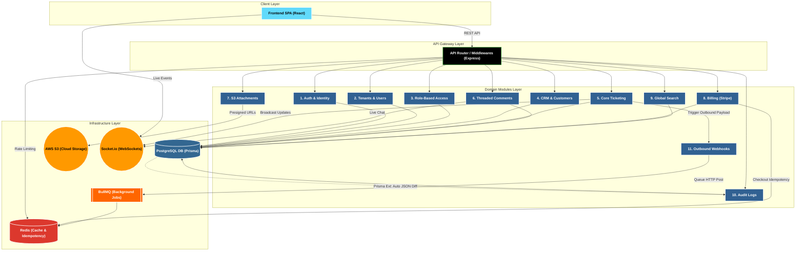

<h1 align="center">FlowDesk</h1>

<p align="center">
  <b>Multi-Tenant CRM, Ticketing & Billing SaaS Platform</b><br/>
  An enterprise-grade, backend-first SaaS platform demonstrating scalable system design, multi-tenant data isolation, and distributed architecture.
</p>

<p align="center">
  
  
  
  
  
  
  
  
</p>

---

## Overview

FlowDesk is a production-ready, multi-tenant SaaS platform built to simulate the complex requirements of modern CRM, customer support ticketing, and subscription billing systems.

Designed as a showcase of senior-level backend engineering, this repository emphasizes distributed systems architecture, database scalability, data isolation, and robust observability. 

---

## Core Engineering Highlights

FlowDesk implements several advanced system design patterns typically found in large-scale enterprise environments:

* **Strict Multi-Tenancy:** Data isolation is enforced at the database level. Every query is automatically scoped to a specific `tenantId` via Node.js `AsyncLocalStorage`, preventing cross-tenant data leakage.
* **Cursor-Based Pagination:** High-volume endpoints (e.g., ticket feeds and audit logs) utilize indexed cursor pagination (`O(1)` time complexity) instead of traditional `OFFSET/LIMIT`, guaranteeing consistent performance regardless of dataset size.
* **Database Audit Logging:** A custom Prisma Client Extension intercepts all `UPDATE` and `DELETE` operations, computes a JSON diff of the changes, and asynchronously writes to an Audit Log table to provide an immutable trail of user actions.
* **Payment Idempotency:** The Stripe checkout and billing routes are protected by a Redis-backed Idempotency middleware. This ensures that network retries or double-clicks do not result in duplicate financial charges.
* **Direct-to-Cloud Uploads:** File attachments bypass the Node.js server entirely. The backend generates AWS S3 Cryptographic Presigned URLs, allowing the client to upload massive payloads directly to the cloud, preserving backend memory and event-loop cycles.
* **Asynchronous Webhooks:** Outgoing webhooks are pushed to a Redis queue and processed by BullMQ background workers. Payloads are cryptographically signed (HMAC SHA-256) and feature exponential backoff retry mechanisms to handle downstream outages.
* **Distributed Observability:** Every HTTP request is assigned a `crypto.randomUUID()` trace ID by the Pino logger. The application natively exposes Prometheus metrics (`/metrics`) for CPU, memory, and latency percentiles.

---

## System Architecture

FlowDesk utilizes a **Domain-Driven Modular Monolith** architecture. The codebase is organized by business domain rather than technical function, allowing for seamless transition into microservices if scaling requirements dictate.



---

## Exhaustive API & Modules Reference

The backend is built around independent, domain-driven modules. Every route (except public Auth/Webhooks) requires a `Bearer Token` and automatically infers the `tenantId` via AsyncLocalStorage to guarantee strict B2B Data Isolation.

### 1. 🔐 Auth Module (`/api/v1/auth`)
Handles Identity and Access Management for the entire platform.
* `POST /register` - Registers a new Company (Tenant) and their first Admin user.
* `POST /login` - Validates credentials and returns JWT Access & HTTP-only Refresh tokens.
* `POST /refresh` - Secure token rotation.
* `GET /google` - Initiates OAuth 2.0 flow for Google Workspace login.

### 2. 🏢 Tenants & Users Module (`/api/v1/tenants`, `/api/v1/users`)
Handles Company settings and employee staff management.
* `GET /tenants` - Fetches global workspace configurations.
* `PATCH /tenants` - Updates company branding and rules.
* `GET /users` - Lists all Agents in the current workspace.
* `POST /users/invite` - Fires a background BullMQ job to email a workspace invitation to a new Agent.
* `PATCH /users/:id` - Updates Agent roles and profile status.

### 3. 🛡️ RBAC Module (`/api/v1/rbac`)
Handles Dynamic Role-Based Access Control.
* `GET /roles` - Lists all dynamic roles (e.g., "Tier 1 Support", "Billing Admin").
* `POST /roles` - Creates a custom role with specific permissions (e.g., `delete:ticket`).
* `POST /roles/:id/assign` - Assigns a custom role to an Agent.

### 4. 👥 CRM Module (`/api/v1/crm`)
Handles the external Customers that the support team is helping.
* `POST /customers` - Adds a new external Customer.
* `GET /customers` - Lists customers with paginated sorting.
* `POST /customers/:id/notes` - Appends internal tracking notes to a Customer's profile.

### 5. 🎫 Tickets Module (`/api/v1/tickets`)
The core workflow engine for the Helpdesk.
* `POST /` - Creates a new support ticket. Automatically triggers Webhooks and Socket.io broadcasts to online Agents.
* `GET /` - Highly optimized feed utilizing **Cursor Pagination** for `O(1)` query speed.
* `PATCH /:id` - Updates status (`open`, `resolved`) or priority (`low`, `critical`).
* `DELETE /:id` - **Soft-Deletes** a ticket (sets `deletedAt` timestamp instead of dropping the row).
* `POST /:id/restore` - Recovers a Soft-Deleted ticket.

### 6. 💬 Comments Module (`/api/v1/comments`)
Handles threaded conversations within Tickets.
* `POST /ticket/:ticketId` - Adds a comment. Can be flagged as `internal` (Agents only) or `public`. Pushed instantly via WebSockets.
* `GET /ticket/:ticketId` - Fetches the chronological conversation history.

### 7. 📎 Attachments Module (`/api/v1/attachments`)
Handles file uploads without choking the Node.js server.
* `POST /ticket/:ticketId/presigned-url` - Returns a temporary **AWS S3 Presigned URL**. The client uses this to upload 50MB+ files directly to the cloud, bypassing the backend.
* `DELETE /:id` - Removes the database reference and triggers S3 deletion.

### 8. 💳 Billing Module (`/api/v1/billing`)
Handles SaaS monetization via Stripe.
* `GET /subscription` - Returns the Tenant's current plan status (Free, Pro, Enterprise).
* `POST /checkout` - Generates a Stripe Checkout URL. Protected by **Redis Idempotency** to prevent double-charging on network retries.
* `POST /portal` - Generates a Stripe Customer Portal session.
* `POST /webhook` - Unauthenticated but cryptographically verified listener. Processes `invoice.paid` and `checkout.session.completed` events asynchronously.

### 9. 🔍 Search Module (`/api/v1/search`)
Handles the global Omnibar functionality.
* `GET /global?q=...` - Executes a PostgreSQL text-search across Tickets, Customers, and Comments simultaneously, returning categorized results.

### 10. 🕵️ Audit Logs Module (`/api/v1/audit-logs`)
Handles compliance and security tracking.
* `GET /` - Fetches an immutable history of database changes. The data is generated completely automatically by a custom Prisma Extension that calculates 'Before vs After' JSON diffs on every mutation.

### 11. ⚙️ Webhooks Module (Background Workers)
Handles outbound data integrations.
* *Background Job* - When a ticket is created, `webhookService` pushes a payload to BullMQ. A background worker picks it up, signs the payload with HMAC SHA-256, and POSTs it to the Tenant's configured Zapier/Slack endpoint.

---

## Technology Stack

**Runtime:** Node.js (v18+)<br/>  
**Framework:** Express.js<br/>
**Database:** PostgreSQL<br/>
**ORM:** Prisma ORM<br/>
**In-Memory Store:** Redis<br/>
**Message Queue:** BullMQ<br/>
**Cloud Storage:** AWS S3<br/>
**Real-Time:** Socket.io<br/>
**Validation:** Joi<br/>
**Logging:** Pino<br/>
**Testing:** Jest & Supertest

---

## Project Structure

```text
flowdesk/
├── backend/
│   ├── prisma/             # Schema definitions & migrations
│   ├── src/
│   │   ├── api/            # Global middlewares (Auth, Context, Idempotency)
│   │   ├── infra/          # Redis, S3, WebSockets, Logger, DB Connections
│   │   ├── jobs/           # BullMQ Worker definitions
│   │   ├── modules/        # Domain-driven feature modules
│   │   └── tests/          # Integration & Security test suites
├── frontend/               # React SPA client
├── docs/                   # Architectural decisions and API references
├── docker-compose.yml      # Local development infrastructure
└── package.json
```

---

## Local Development Setup

**1. Prerequisites**
Ensure you have Node.js (v18+), Docker, and Docker Compose installed.

**2. Clone the Repository**
```bash
git clone https://github.com/MARKASCHARAN/flowdesk.git
cd flowdesk
```

**3. Infrastructure**
Start PostgreSQL and Redis using Docker Compose:
```bash
docker-compose up -d
```

**4. Backend Initialization**
```bash
cd backend
npm install
cp .env.example .env

# Generate Prisma Client & Run Migrations
npx prisma generate
npx prisma migrate dev
```

**5. Start the Server**
```bash
# Run the API and background workers
npm run dev

# Run the integration test suite
npm test
```

---

## Documentation

Extensive internal documentation can be found in the `/docs` directory, including:
- **API & Schema Reference:** Detailed breakdown of database relations and HTTP endpoints.
- **Architecture Guide:** Explanations of request lifecycles and middleware implementations.

---

## Author

**Marka Sai Charan**  
Software Engineer specializing in high-performance backend engineering, scalable distributed systems, and production-grade infrastructure. Passionate about solving complex technical challenges through competitive programming and building resilient developer tools.